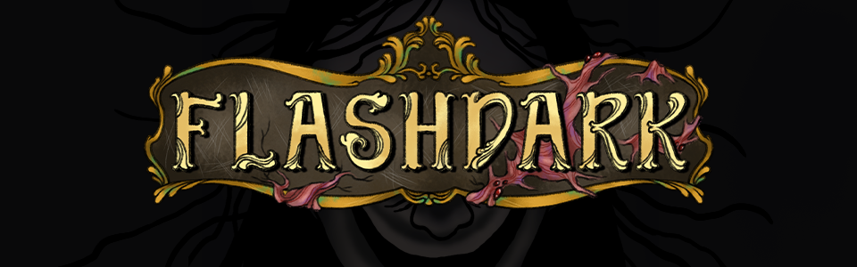

# Flashdark

A puzzle horror game made for [GitHub Game Off 2022](https://itch.io/jam/game-off-2022).

*There's something wrong at your Grandmother's house...*

[Watch the Trailer](TODO youtube)

## Controls

- WASD - movement
- Mouse move - look around
- Mouse buttons or E - interact
- C - toggle crouching
- Q or G - drop the item
- P or Enter or Escape - pause
- F11 - toggle fullscreen

## Credits

- Illustrations - [Rincs](https://rincsart.com/)
- Programming & Game Design - [kuviman](https://github.com/kuviman)
- Sound Design & 3D & Game Design - [Brainoid](https://twitter.com/brainoidgames)

## Building & running the game from source

- [Install Rust](https://rustup.rs)
- `cargo run --release`

That's it
